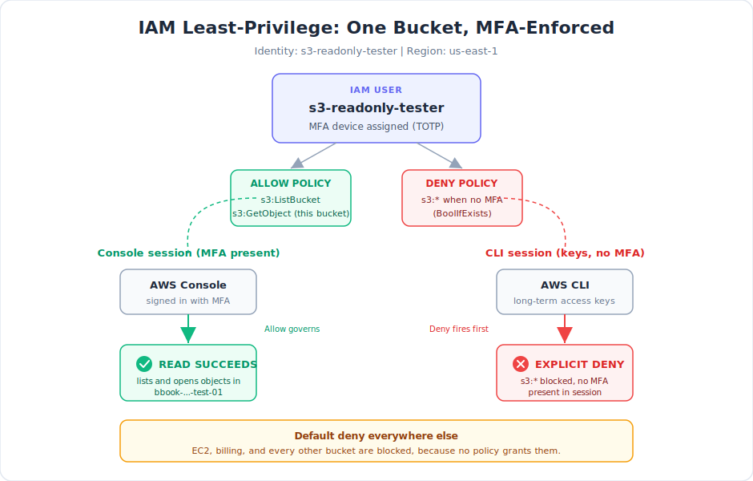
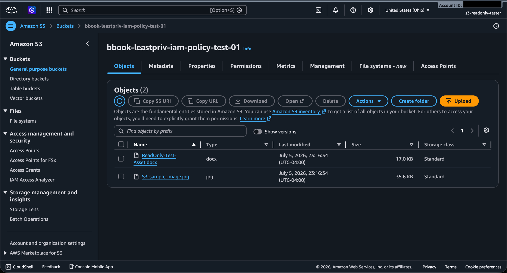
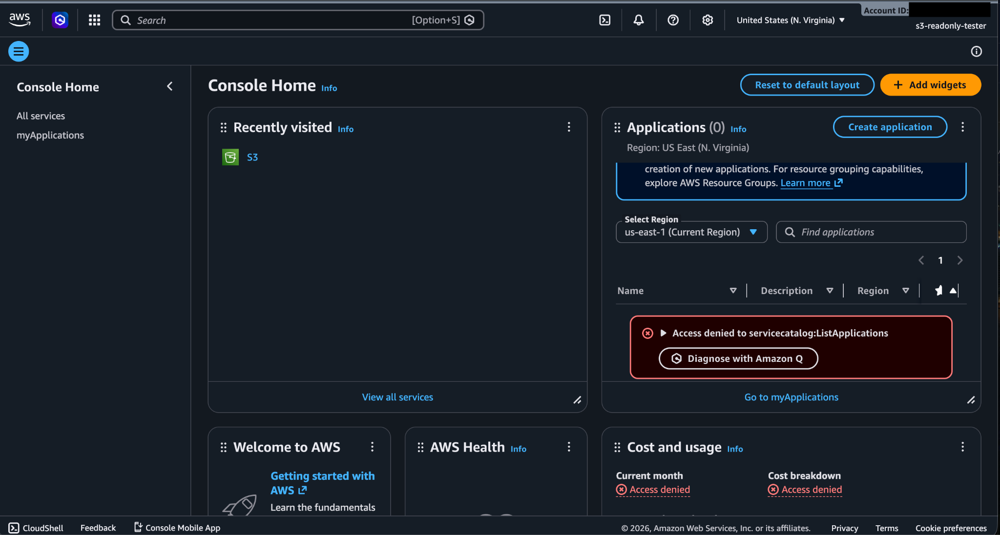
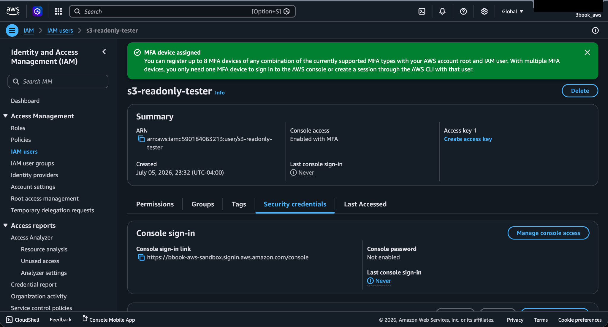
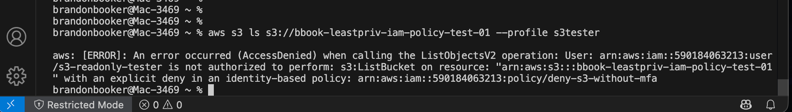

# AWS IAM Least-Privilege Lab: Single-Bucket S3 Access with MFA Enforcement

Scoped an IAM user to read exactly one S3 bucket and nothing else, enforced MFA at sign-in, and blocked every programmatic action that lacks MFA. Verified each boundary by testing from the restricted user's own perspective.

**Stack:** AWS IAM, Amazon S3, AWS CLI, virtual MFA (TOTP)

**Region:** us-east-1

**Completed:** *July 5, 2026*


## Summary

The user `s3-readonly-tester` can list and read objects in one named bucket, must use MFA to reach the console, and is denied all S3 actions when no MFA is present in the session. Access to every other service is denied by default, because no policy grants it.

The point of the lab is the verification, not the click path. Each control was exercised against the live account and each expected allow and deny was confirmed.

## Architecture



One identity, two access paths. Console access carries MFA, so the allow policy governs and the read succeeds. CLI access uses long-term keys with no MFA, so the deny policy fires first and blocks the call. Anything outside the single bucket falls through to an implicit deny.

## Objective

Grant an identity the minimum access for one job, reading one bucket, prove it cannot reach anything else, and require MFA so that stolen long-term keys alone cannot exercise the permission.

## What I built

**1. Least-privilege allow policy** (`s3-readonly-single-bucket`)

Grants two actions against one bucket and nothing more. The two statements target different resources on purpose: `ListBucket` acts on the bucket, `GetObject` acts on the objects inside it.

```json
{
  "Version": "2012-10-17",
  "Statement": [
    {
      "Sid": "ListOneBucketOnly",
      "Effect": "Allow",
      "Action": "s3:ListBucket",
      "Resource": "arn:aws:s3:::bbook-leastpriv-iam-policy-test-01"
    },
    {
      "Sid": "ReadObjectsInThatBucket",
      "Effect": "Allow",
      "Action": "s3:GetObject",
      "Resource": "arn:aws:s3:::bbook-leastpriv-iam-policy-test-01/*"
    }
  ]
}
```

**2. Deny-without-MFA policy** (`deny-s3-without-mfa`)

Denies every S3 action when MFA is absent from the session. Attached only to the test user.

```json
{
  "Version": "2012-10-17",
  "Statement": [
    {
      "Sid": "DenyS3WithoutMFA",
      "Effect": "Deny",
      "Action": "s3:*",
      "Resource": "*",
      "Condition": {
        "BoolIfExists": {
          "aws:MultiFactorAuthPresent": "false"
        }
      }
    }
  ]
}
```

I used `BoolIfExists` rather than `Bool` deliberately. Plain `Bool` only matches when the MFA key is present in the request. Some calls omit that key entirely, which a plain `Bool` deny would miss. `BoolIfExists` denies both when MFA is explicitly false and when the key is absent, which closes that gap.

**3. MFA enforcement**

Assigned a virtual MFA (TOTP) device to the user. The console now requires a code at sign-in.

**4. Programmatic test credential**

Issued one long-term access key to exercise the no-MFA path from the CLI. Removed at the end (see Cleanup).

## How I verified it

| Test | Path | Expected | Result |
|------|------|----------|--------|
| Read the target bucket | Console (MFA) | Allowed | Objects listed and opened |
| Reach other services (EC2, billing, other buckets) | Console (MFA) | Denied | Access denied |
| List the bucket over the CLI | CLI (keys, no MFA) | Denied | Explicit deny |

### Evidence

**Console (MFA session): read succeeds**


**Console: access denied on services outside the bucket**


**MFA device assigned to the user**


**CLI (no MFA): explicit deny**


The CLI error included the phrase "explicit deny in an identity-based policy," which confirms the deny policy fired rather than a plain absence of permission. Account ID is redacted in the capture.

## What I learned

**`ListBucket` is not `ListAllMyBuckets`.** The restricted user could not see the bucket on the S3 landing page, because enumerating all buckets is a separate permission I chose not to grant. The user still reached the bucket by direct navigation. Listing every bucket and reading one named bucket are different privileges, and least privilege means granting only the second.

**ARNs and S3 names must match exactly.** My first read attempt failed with a "bucket cannot be found" error. The cause was a single capitalized letter in the name I typed into the URL. S3 bucket names are lowercase, and IAM matches resources by exact string, so a one-character case difference is enough to break access. This mirrors a real misconfiguration, not just a typo.

**Explicit deny always wins.** The same user reads the bucket in the console but is blocked over the CLI. The only difference is whether MFA is present in the session. An explicit deny overrides any allow, which is what turns the MFA condition into a hard control rather than a suggestion.

## What I would do in production

- Replace long-term access keys with IAM roles and short-lived credentials issued through STS.
- Add a permissions boundary to cap the maximum access this identity could ever receive.
- Manage both policies as code (Terraform or CloudFormation) for review, diffing, and repeatability.
- Apply the MFA-enforcement pattern through a group policy rather than per user.

## Cleanup

- Deleted the access key.
- Deleted the IAM user `s3-readonly-tester`.
- Deleted the `s3-readonly-single-bucket` and `deny-s3-without-mfa` policies.
- Deleted the demo bucket.

Tearing down credentials and resources after a test is part of the exercise.

## Skills demonstrated

IAM policy authoring, least privilege, MFA enforcement, conditional deny logic, policy evaluation order, S3 access control, AWS CLI, credential hygiene.
